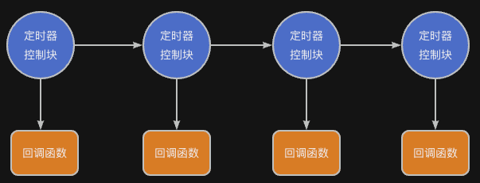

> 为了更好地使用RTOS，我们需要深入理解RTOS工作原理，最好的方法是动手写一个RTOS。
>
> 如果你希望写一个类似RT-Thread/FreeRTOS的系统，欢迎关注这门课程：[【RTOS内核开发】从0手写嵌入式操作系统](https://zw8ls.xetlk.com/s/H2F1Y)
>

本小节介绍RT-Thread中定时器相关API的使用。

> 注意，与API使用相关的部分细节，会在后面的课时中说明。
>

## 定时器的基本结构
RT-Thread使用软件方法来创建软定时器，从而提供不受硬件定时器数量限制的定时器。每个软定时器使用定时器控制块rt_timer_t来进行管理。



在定时控制块中，存储定时器的一些信息，例如初始节拍数，超时时的节拍数，也包含定时器与定时器之间连接用的链表结构，超时回调函数等。

在这些信息中，核心的信息有：

+ **定时时长**：多少个 tick 之后触发
+ **是否周期**：一次性或者周期性执行
+ **回调函数**：定时触发时调用的函数
+ **运行上下文**：在什么环境（定时中断、软定时器任务）中执行

## 示例一：创建周期性和一次性定时器
下面的例子中演示了使用相关的接口创建了两种类型的定时器：

+ 周期性定时器led_timer：每隔500ms闪烁一次LED
+ 一次性定时器：在启动定时器3秒后，点亮LED

```c
#include <rtthread.h>
#include "base.h" 
#include "rtconfig.h"
#include "rtdef.h"

// 回调函数
static void led_timer_cb(void *parameter) {
    RT_UNUSED(parameter);
    led_toggle(LED0);  // 切换LED 状态
}

struct rt_timer oneshort_timer;

static void oneshort_timer_cb (void * parameter) {
    RT_UNUSED(parameter);

    led_set(LED1, 1);
}

int main (void) {
    hardware_init();
    
    // 创建一个周期性定时器（1000ms）
    rt_timer_t led_timer = rt_timer_create("led_t",
                                led_timer_cb,
                                RT_NULL,
                                rt_tick_from_millisecond(500),  // RT_TICK_PER_SECOND, 
                                RT_TIMER_FLAG_PERIODIC);

    if (led_timer != RT_NULL) {
        rt_timer_start(led_timer);  // 启动定时器
    }

    rt_timer_init(&oneshort_timer, "oneshort",
        oneshort_timer_cb, RT_NULL, 3*RT_TICK_PER_SECOND,   // 3秒
        RT_TIMER_FLAG_ONE_SHOT);    
    rt_timer_start(&oneshort_timer);

    return 0;
}
```

## 示例二：重启或结束定时器
在定时器回调函数被调用时，可以手动重启或者停止定时器。示例代码如下：

```c
#include <rtthread.h>
#include "base.h" 
#include "rtconfig.h"
#include "rtdef.h"

rt_timer_t led_timer;
// 回调函数
static void led_timer_cb(void *parameter) {
    RT_UNUSED(parameter);
    led_toggle(LED0);  // 切换LED 状态

    static int count;
    if (++count == 20) {
        // 可以关闭
        rt_timer_stop(led_timer);
    }
}

struct rt_timer oneshort_timer;

static void oneshort_timer_cb (void * parameter) {
    RT_UNUSED(parameter);

    led_toggle(LED1);

    // 可以重启
    rt_timer_start(&oneshort_timer);
}

int main (void) {
    hardware_init();

    // 创建一个周期性定时器（1000ms）
    led_timer = rt_timer_create("led_t",
                                led_timer_cb,
                                (void *)20,
                                rt_tick_from_millisecond(500),  // RT_TICK_PER_SECOND, 
                                RT_TIMER_FLAG_PERIODIC);

    if (led_timer != RT_NULL) {
        rt_timer_start(led_timer);  // 启动定时器
    }

    rt_timer_init(&oneshort_timer, "oneshort",
        oneshort_timer_cb, RT_NULL, 3*RT_TICK_PER_SECOND,   // 3秒
        RT_TIMER_FLAG_ONE_SHOT);    
    rt_timer_start(&oneshort_timer);

    return 0;
}
```

）

