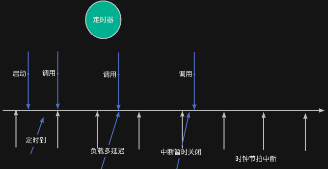

> 为了更好地使用RTOS，我们需要深入理解RTOS工作原理，最好的方法是动手写一个RTOS。
>
> 如果你希望写一个类似RT-Thread/FreeRTOS的系统，欢迎关注这门课程：[【RTOS内核开发】从0手写嵌入式操作系统](https://zw8ls.xetlk.com/s/H2F1Y)
>

本小节介绍定时器使用时的常见注意事项，从而避免常见错误和不当用法，实现学会在实际项目中更稳定、安全地使用定时器

## 回调函数运行在中断/任务上下文
对于HARD_TIMER模式的定时器，由系统时钟节拍中断处理程序扫描定时器列表并执行回调函数；因此，<font style="color:#DF2A3F;">禁止使用 </font>rt_thread_mdelay()等让当前中断暂停执行的API。RT-Thread可能无法处理这种问题，进而导致整个系统运行出现混乱。

同样地，对于SOFT_TIMER模式的定时器，由定时器任务扫描并执行回调函数；<font style="color:#DF2A3F;">不建议</font>使用rt_thread_mdelay()等让当前任务暂停执行的API。这将造成定时器任务无法及时扫描并执行其它定时器的回调函数。

:::info
因此，在定时器回调处理函数中，最好是快速完成相关的工作。如果有耗时的任务，建议交由其它任务去完成。

:::

例如，可以通过简单地设置标志位（或者用信号量、消息队列等机制）来实现这种操作。

```c
#include <rtthread.h>
#include "base.h"

// 全局定时器句柄
rt_timer_t led_timer;

// 标志变量：标志LED是否停止
volatile rt_bool_t led_stopped = RT_FALSE;

// 回调函数
static void led_timer_cb(void *parameter)
{
    RT_UNUSED(parameter);
    led_toggle(LED0);  // 切换 LED 状态

    static int count = 0;
    if (++count >= 20)
    {
        rt_timer_stop(led_timer);      // 停止定时器
        led_stopped = RT_TRUE;         // 设置标志位
    }
}

// 打印线程入口
static void print_task_entry(void *parameter) {
    RT_UNUSED(parameter);
    
    while (1) {
        if (led_stopped) {
            rt_kprintf("LED stopped flashing after 20 times.\n");
            // 为了不重复打印，只执行一次后清标志
            led_stopped = RT_FALSE;
        }

        rt_thread_mdelay(200);  // 每200ms检查一次
    }
}

int main(void)
{
    hardware_init();

    // 创建LED定时器，500ms周期，周期性，软定时器
    led_timer = rt_timer_create("led_t",
                                led_timer_cb,
                                RT_NULL,
                                rt_tick_from_millisecond(500),
                                RT_TIMER_FLAG_PERIODIC | RT_TIMER_FLAG_SOFT_TIMER);

    if (led_timer != RT_NULL)
    {
        rt_timer_start(led_timer);  // 启动定时器
    }

    // 创建任务线程，检测 LED 状态
    rt_thread_t tid = rt_thread_create("print_task",
                                       print_task_entry,
                                       RT_NULL,
                                       1024,
                                       20,
                                       10);
    if (tid != RT_NULL)
        rt_thread_startup(tid);

    return 0;
}

```

## 定时准确度
虽然RT-Thread的定时器可用于实现毫秒级别的周期性事件，但**它并不一定能实现“精确定时”**。

也就是说，假设设置了一个定时器每1000ms执行一次，但它实际触发的时间可能是1002ms、998ms。

| 因素 | 说明 |
| --- | --- |
| **系统时钟节拍周期** | RT-Thread 使用tick计时（默认1 tick = 1ms），无法实现小于一个系统时钟节拍时期的时长定时。 |
| **系统负载** | 对于SOFT_TIMER定时器而言，当系统任务过多，或者高优先级任务长时间占用 CPU，定时器线程无法及时执行回调函数，从而产生延迟。 |
| **定时器数量** | 由于系统中定时器进行了排队，当队列中定时器较多且超时的任务较多时，会延后后面的定时器的任务执行。 |
| **定时器类型** | 对于HARD_TIMER定时器而言，当程序中中断屏蔽时间太长时，将影响到系统中定时器回调函数的执行时间。 |
| **中断屏蔽时间** | 如果代码中大量禁用了中断，也可能延迟系统时钟节拍的响应，从而影响定时器触发时机。 |
| **使用不当** | 比如在定时器回调中做了太复杂的操作，影响下一次周期到达。 |


下面通过一个简单的图示，可以看出定时器回调函数不一定被准时调用。



## HARD/SOFT定时器，该选哪种？
在 RT-Thread 中，创建的定时器可以是“软定时器（SOFT）”或“硬定时器（HARD）”。这两者都会在设定的时间后回调一个函数，但**触发机制不同**，会影响程序的实时性和安全性。

> 想实现“定时1秒闪灯”，你会选择哪个？
>

我们已知这两种类型的定时器各有特点，我们在实际使用时可以参考如下表格：

| 类型 | 执行位置 | 响应速度 | 回调函数限制 | 使用场景 |
| --- | --- | --- | --- | --- |
| **硬定时器** | 中断上下文 | 快速、精确 | 严格，不能阻塞、不允许长时间计算 | 实时性强、快速响应任务，如数据采集、电机控制等 |
| **软定时器** | 定时器任务 | 稍慢 | 灵活，可调度任务、可打印 | 日常逻辑定时处理，如LED闪烁、状态轮询、自动保存等 |


例如，对于下述场景，我们可以根据这两类定时器特点做出不同的选择；

| 应用场景 | 推荐使用 |
| --- | --- |
| 1s 闪烁 LED 指示灯 | 软定时器 |
| 数据采集每 1ms 精确触发 | 硬定时器 |
| 10 秒后保存参数到 Flash | 软定时器 |
| 定时唤醒线程处理数据 | 软定时器 |
| 快速响应 GPIO 变化的处理 | 硬定时器 或中断 |


也就是说，在选择使用定时器时，我们可以：

+ 如果需要在**中断上下文中快速响应**，选择**硬定时器**
+ 如果需要**安全灵活的定时处理**逻辑（比如打印、处理逻辑），优先选**软定时器**
+ 实在不确定？建议从软定时器入手，再根据性能需求调整

:::info
特别要注意：当系统中HARD_TIMER定时器较多且执行时间较长时，将大大影响时间片调度的执行。

:::

## 总结
+ 定时器功能强大但容易误用，需了解其运行环境（HARD、SOFT）
+ 回调中避免耗时操作，用信号量交由线程处理
+ 动态定时器和封装结构可实现更灵活设计
+ 精度与tick配置、系统负载密切相关

## 补充说明
在视频中，我写了这样的代码。如果实际调试，可能会发现，main无法继续往下执行rt_timer_create()等函数，CPU会一直执行threa_entry()中的while(1）循环。

之所以如此，是因为rt_thread_startup(thread)执行时，由于thread的优先级为0（最高），RT-Thread会转而执行该任务的代码。而由于 thread_entry()一直在死循环，没有延时、挂起等操作，所以一直占用CPU运行，导致低优先级的main任务、定时器任务无法运行。

```c
#include <rtthread.h>
#include "base.h" 
#include "rtconfig.h"

static rt_timer_t led_timer;

static void led_timer_cb (void * parameter) {
    led_toggle(LED0); 
    
    static int count;
    if (++count == 20) {
        rt_timer_stop(led_timer);
    }
}

struct rt_timer oneshort_timer;

static void oneshort_timer_cb (void * parameter) {    
    led_toggle(LED1);
    
    rt_timer_start(&oneshort_timer);
    
}

void thread_entry (void * param) {
    while (1) {
        
    }
    
}

int main (void) {
    hardware_init();
    
    rt_thread_t thread = rt_thread_create("thread",
                thread_entry, RT_NULL,
                4096, 0, 200);
    rt_thread_startup(thread);
    
    led_timer = rt_timer_create("led",
                led_timer_cb, RT_NULL, 
                rt_tick_from_millisecond(10),          // tick
                RT_TIMER_FLAG_PERIODIC );
    rt_timer_start(led_timer);
    
    rt_timer_init(&oneshort_timer, "oneshort",
                oneshort_timer_cb, RT_NULL,
                3*RT_TICK_PER_SECOND,       //        rt_tick_from_millisecond(3000),  
                RT_TIMER_FLAG_ONE_SHOT | RT_TIMER_FLAG_SOFT_TIMER);
    rt_timer_start(&oneshort_timer);
    return 0;
}
```

