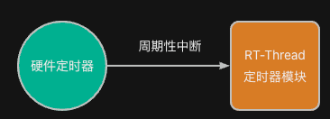
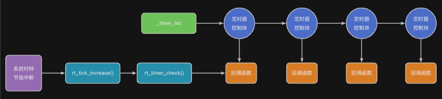
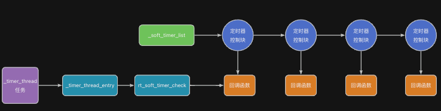

由于定时器模拟实现的一些机制，将导致我们在使用时容现某些低级错误。为了更好地理解这些错误，本小节介绍RT-Thread定时器的基本设计原理。

> 注：本小节只对其设计做比较简单的介绍，目的是更好地掌握API的使用。
>

## 定时器是如何被触发的？
与时间片轮转机制工作原理类似，RT-Thread定时器依赖系统**时钟节拍（tick）中断** 来触发执行。如下图所示：



当系统时钟节拍产生一次tick中断时，RT-Thread 会调用rt_tick_increase，tick 计数器加 1。

1. 系统检查所有已启动的定时器。
2. 若某定时器的超时时间已到：执行其绑定的回调函数（在中断上下文中）。
3. 若是周期定时器，重置下次触发时间。

:::info
定时器精度：由于定时器基于系统时钟节拍中断触发执行；因此，可知其精度受时钟节拍周期影响，即最小的定时时间为1个tick。

:::

## HARD_TIMER模式的定时器
默认情况下，创建的定时器会被加入到定时器队列_timer_list中，且该链表为**按触发时间排序的链表。**

```c
static rt_list_t _timer_list[RT_TIMER_SKIP_LIST_LEVEL];
```

当我们调用rt_timer_start()启动定时器时，定时器将插入到该队列中。



这样一来，当定时中断发生时：RT-Thread检查各个定时器是否满足超时条件。若满足，调用其回调函数，并且将周期定时器重新插入链表。而如果是一性次的定时器，则会从该链表中移除。

## SOFT_TIMER模式的定时器
此外，还有另外一种模式的定时器，SOFT_TIMER。要启用这种定时器，只需要在创建定时器时传递以下标志宏：

```c
#define RT_TIMER_FLAG_SOFT_TIMER    0x4     /* 软件定时器   */
```

在RT-Thread内部，采用了专门的定时器任务来扫描这些定时器，并执行回调函数。



上述任务相关的配置宏如下：

```c
#define RT_TIMER_THREAD_PRIO        4
#define RT_TIMER_THREAD_STACK_SIZE  512
```

## 示例：创建SOFT_TIMER模式的定时器
下面的代码演示了如何创建SOFT_TIMER模式的定时器。

```c
#include <rtthread.h>
#include "base.h" 
#include "rtconfig.h"
#include "rtdef.h"

rt_timer_t led_timer;
// 回调函数
static void led_timer_cb(void *parameter) {
    RT_UNUSED(parameter);
    led_toggle(LED0);  // 切换LED 状态

    static int count;
    if (++count == 20) {
        // 可以关闭
        rt_timer_stop(led_timer);
    }
}

struct rt_timer oneshort_timer;

static void oneshort_timer_cb (void * parameter) {
    RT_UNUSED(parameter);

    led_toggle(LED1);

    // 可以重启
    rt_timer_start(&oneshort_timer);
}

int main (void) {
    hardware_init();

    // 创建一个周期性定时器（1000ms）
    led_timer = rt_timer_create("led_t",
                                led_timer_cb,
                                (void *)20,
                                rt_tick_from_millisecond(500),  // RT_TICK_PER_SECOND, 
                                RT_TIMER_FLAG_PERIODIC | RT_TIMER_FLAG_SOFT_TIMER);

    if (led_timer != RT_NULL) {
        rt_timer_start(led_timer);  // 启动定时器
    }

    rt_timer_init(&oneshort_timer, "oneshort",
        oneshort_timer_cb, RT_NULL, 3*RT_TICK_PER_SECOND,   // 3秒
        RT_TIMER_FLAG_ONE_SHOT | RT_TIMER_FLAG_SOFT_TIMER);    
    rt_timer_start(&oneshort_timer);

    return 0;
}
```


### 
