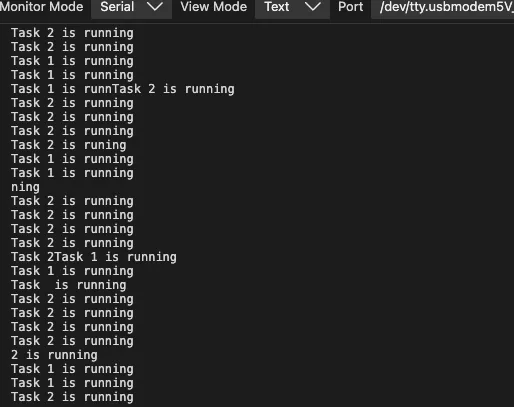
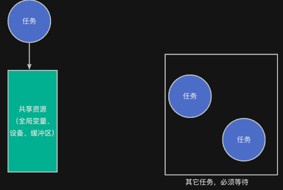
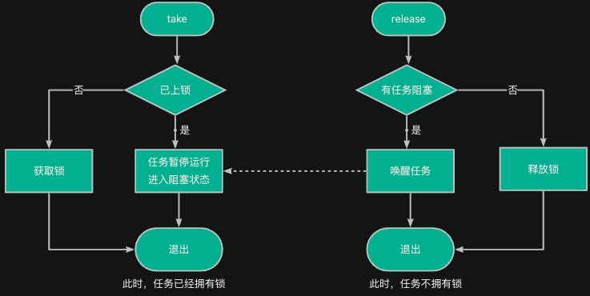

> 为了更好地使用RTOS，我们需要深入理解RTOS工作原理，最好的方法是动手写一个RTOS。
>
> 如果你希望写一个类似RT-Thread/FreeRTOS的系统，欢迎关注这门课程：[【RTOS内核开发】从0手写嵌入式操作系统](https://zw8ls.xetlk.com/s/H2F1Y)
>

## 生活示例
想象一下：你和几个朋友在办公室里工作，大家共用一台打印机。但打印机一次只能服务一个人。如果大家同时操作打印机，就会造成混乱、卡纸，甚至损坏。


于是你们商量好了一条规则：打印机上挂了一把“钥匙”。

+ 谁要打印文件，必须先拿到钥匙。
+ 如果钥匙在挂钩上，你就可以拿走它、开始打印。打印完之后，一定要把钥匙挂回去，表示你已经用完了。
+ 如果有人来发现钥匙不在，就知道打印机正在被使用，只能在一旁等着钥匙归位。

通过这样的机制，可以保证：<font style="color:#2F4BDA;">它的作用是保证：同一时间只有一个人能使用共享资源（这里是打印机）。</font>

## 互斥锁的用途
在嵌入式系统中，**多个任务常常会访问同一个“共享资源”，比如一个全局变量、一个设备、一个内存缓冲区等**。

如果不加控制，同时访问这些资源，轻则数据出错，重则系统崩溃。为了防止这种“数据竞争”，我们就需要**互斥访问机制**，而互斥锁正是其中最常见的一种。

例如，当两个任务同时连续不断地往同一串口进行打印输出时，可能会出现打印结果混乱的情况。具体如下图所示：



因此，最好是同一时间，只允许一个任务访问该资源，其它任务必须等待。



互斥锁（mutex）用于**保护共享资源不被多个任务同时访问**。它通过“加锁”和“解锁”的操作，确保同一时刻最多只有一个任务进入临界区。其使用逻辑如下：

+ 每个任务在使用前都要“上锁”（就像拿钥匙）。
+ 用完后必须“解锁”（把钥匙挂回去）。
+ 如果别人正在用，自己就要等锁（等钥匙回来）。

## 工作原理
互斥锁的使用主要包括两个操作：

| 操作 | 说明 |
| --- | --- |
| take（上锁） | 尝试获得互斥锁。如果已被其他任务持有，则阻塞等待 |
| release（解锁） | 释放互斥锁，允许其他任务获取 |


其流程如下：



## 与信号量的区别
虽然信号量也可用于资源的互斥访问（将初始计数值设置为1），但互斥锁有自己的特点：

| 特性 | 信号量（semaphore） | 互斥锁（mutex） |
| --- | --- | --- |
| 是否支持多个资源 | 可以（计数信号量） | 否，一次只能一个任务持有 |
| 是否支持递归上锁 | 否 | 是（在RT-Thread中支持递归），可避免同一任务多次递归持有而造成死锁的问题 |
| 是否有优先级继承 | 否 | 是，防止优先级反转问题 |
| 是否可用于同步 | 是 | 否（只用于互斥） |


## 应用示例
### 多任务写日志
假设多个任务都要向一个串口或日志缓冲区输出信息，如果不加控制，会导致串行数据混杂、乱码。使用互斥锁可以很好地保护这个输出过程。

```c
#include <rtthread.h>
#include "base.h" 
#include "rtconfig.h"

static struct rt_mutex mutex;

void task_entry (void * param) {
    while (1) {
        // take()
        rt_mutex_take(&mutex, RT_WAITING_FOREVER);
        rt_kprintf("%s is running\n", rt_thread_self()->name);
        rt_mutex_release(&mutex);
        // release()
    }
}

int main (void) {
    hardware_init();
    
    rt_mutex_init(&mutex, "mutex", RT_IPC_FLAG_FIFO);
    
    rt_thread_t t1 = rt_thread_create("t1", task_entry, RT_NULL, 4096, 11, 10);
    rt_thread_startup(t1);
    rt_thread_t t2 = rt_thread_create("t2", task_entry, RT_NULL, 4096, 11, 10);
    rt_thread_startup(t2);
    
}

```

### 共同访问结构体
当多个任务共同读写同一数据时，有可能造成错误。例如，下面是两个任务同时对shared_time进行访问。如果time_upd在更新时间的过程中，被打断执行；那么，time_read可能读取到错误的数值。

```c

/* 时间结构体 */
typedef struct
{
    int year;
    int month;
    int day;
    int hour;
    int minute;
    int second;
} time_info_t;

/* 共享时间结构体 */
static time_info_t shared_time = {2025, 1, 1, 0, 0, 0};

/* 互斥锁对象 */
static rt_mutex_t time_mutex = RT_NULL;

/* 写任务：更新时间 */
void time_update_thread(void *parameter)
{
    while (1)
    {
        //rt_mutex_take(time_mutex, RT_WAITING_FOREVER);

        shared_time.second++;
        if (shared_time.second >= 60)
        {
            shared_time.second = 0;
            shared_time.minute++;
        }
        if (shared_time.minute >= 60)
        {
            shared_time.minute = 0;
            shared_time.hour++;
        }
        if (shared_time.hour >= 24)
        {
            shared_time.hour = 0;
            shared_time.day++;
        }

        // 此处略过月份与年份进位逻辑，保持简洁
        //rt_mutex_release(time_mutex);
        rt_thread_mdelay(1);
    }
}

/* 读任务：打印当前时间 */
void time_read_thread(void *parameter)
{
    time_info_t local_time;

    while (1)
    {
        //rt_mutex_take(time_mutex, RT_WAITING_FOREVER);

        /* 读取共享时间到局部变量 */
        local_time = shared_time;

        //rt_mutex_release(time_mutex);

        rt_kprintf("[Reader] Time: %04d-%02d-%02d %02d:%02d:%02d\n",
                   local_time.year, local_time.month, local_time.day,
                   local_time.hour, local_time.minute, local_time.second);

        rt_thread_mdelay(10); 
    }
}

/* 初始化函数 */
int main(void)
{
    time_mutex = rt_mutex_create("time_mutex", RT_IPC_FLAG_PRIO);

    rt_thread_t tid_update = rt_thread_create("time_upd", time_update_thread, RT_NULL,
                                              1024, 10, 10);
    rt_thread_t tid_read = rt_thread_create("time_read", time_read_thread, RT_NULL,
                                            1024, 10, 10);

    if (tid_update) rt_thread_startup(tid_update);
    if (tid_read) rt_thread_startup(tid_read);

    return 0;
}
```

比如，当前时间是2025-1-1 23:59:00，当time_upd刚执行完shared_time.minute = 0时被打断。此时，时间为2025-1-1 23:00:00秒，而恰好time_read读取了该值，则读得的正好为错误的值。

因此，对于上述情况下，也需要使用互斥锁进行保护。


