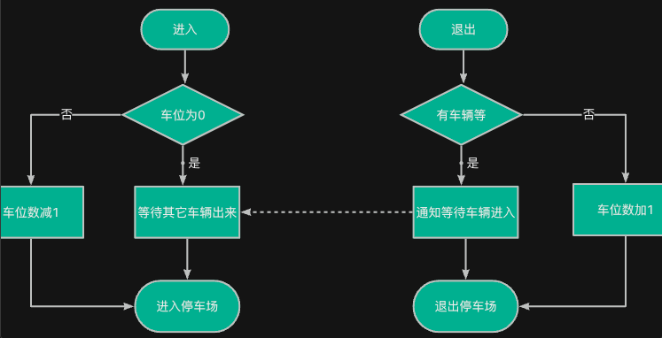
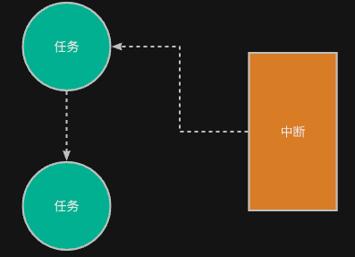
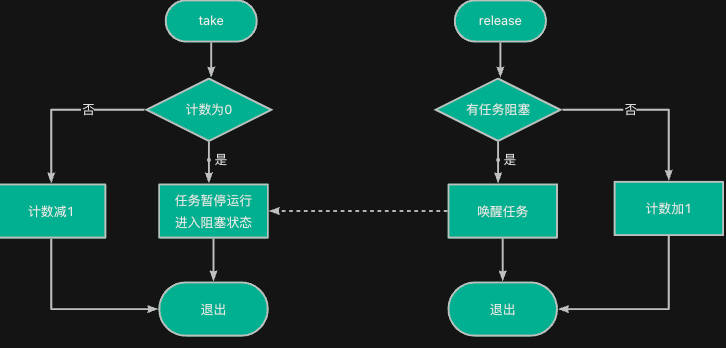
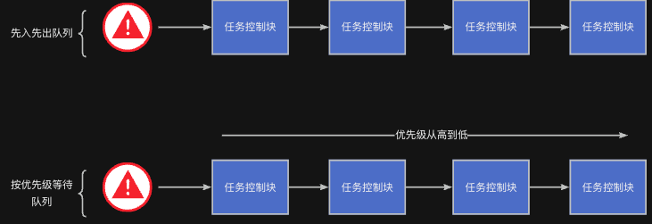

> 为了更好地使用RTOS，我们需要深入理解RTOS工作原理，最好的方法是动手写一个RTOS。
>
> 如果你希望写一个类似RT-Thread/FreeRTOS的系统，欢迎关注这门课程：[【RTOS内核开发】从0手写嵌入式操作系统](https://zw8ls.xetlk.com/s/H2F1Y)
>

:::info
注意，RTOS提供的信号量、互斥锁等，提供了一些比较通用的任务访问资源、行为同步的方案。它们不是某个具体的问题，所以我们在学习相关内容时，可能会感觉到有些概念和使用方法有些抽像，不好理解。


建议在学习过程中，针对自己的实际项目，看看这些功能可以如何使用。

:::

## 生活示例
想象一下，当你开着车，到达一个停车场，门口有一个显示牌，写着：

> 🅿️ 当前剩余车位：**66**
>

这个数字代表什么？它代表当前可以停进去的车辆数。每有一辆车进来，数字就减1；而有一辆车离开，数字就加1。


当数字0时，你必须在入口等待，直至一辆车出来后你再进去；此时，车位数仍然显示为0.

而如果数字不为0，你可以直接进入，无需等待车出来；此时，车位数将减1



## 信号量有什么用？
在多任务系统中，**任务之间并不是完全独立运行的，常常需要某种“握手”、“通知”等方式**来协作配合工作。例如：

+ 一个任务等待传感器数据采集完毕；
+ 主任务等待一个中断通知再继续处理；
+ 多个任务共享一个队列，谁先谁后要有控制。

这时候，可以借助信号量来实现这些功能。



## 工作原理
信号量是一个**计数器**，它控制资源访问或实现任务同步，其主要包含两个操作：

| 操作 | 说明 |
| --- | --- |
| take（获取、等待） | 将信号量值减 1，若为 0 则阻塞 |
| release（释放） | 将信号量值加 1，唤醒等待的任务 |


两个操作的工作流程图如下：



我们可以将信号量的行为对照与停车站计数的行为进行类似，可以看到二者是很相似的：

| 现实场景  | 信号量 |
| --- | --- |
| 停车场剩余车位数 | 等效于信号量值 |
| 有车进来，车位减1 | 获取信号量 |
| 有车出去，车位加1 | 释放信号量 |
| 没有车位了，车只能等在外面排队 | 信号量为0，任务阻塞 |
| 一旦有车离开，前面排队的车才能进 | 唤醒一个等待任务，如果无任务等待，则计数加1 |


<font style="color:#2F4BDA;">对于需要等待的任务，RT-Thread会在信号上安排等待队列，将任务插入队列中等待。在等待队列中，可以设置任务按	先进先出模式还是优先级模式模式进行排序。当需要唤醒等待的任务时，总是取队列头部的任务进行唤醒。</font>



## 应用示例
### 模拟停车场信号量
下面通过一个例子，来演示如何用信号量控制任务是否能执行指定的代码（仍以停车场为例）

```c
#include <rtthread.h>
#include "base.h" 
#include "rtconfig.h"
#include "rtdef.h"

struct rt_semaphore park_sem;

void car_entry_thread(void *parameter) {
    while (1) {
        // 想进停车场
        rt_sem_take(&park_sem, RT_WAITING_FOREVER);
        
        rt_kprintf("%s enter!\n", rt_thread_self()->name);
        rt_thread_mdelay(2000); // 停两秒
        rt_kprintf("%s exit!\n", rt_thread_self()->name);
        rt_sem_release(&park_sem);

        rt_thread_mdelay(1000);
    }
}

int main(void) {
    hardware_init();

    // 初始化“停车场”，有3个车位
    rt_sem_init(&park_sem, "park", 1, RT_IPC_FLAG_FIFO);

    // 创建多个模拟车辆的线程
    rt_thread_startup(rt_thread_create("car1", car_entry_thread, RT_NULL, 1024, 10, 20));
    rt_thread_startup(rt_thread_create("car2", car_entry_thread, RT_NULL, 1024, 10, 20));
    rt_thread_startup(rt_thread_create("car3", car_entry_thread, RT_NULL, 1024, 10, 20));
    rt_thread_startup(rt_thread_create("car4", car_entry_thread, RT_NULL, 1024, 10, 20));

    return 0;
}
```

通过以上例子可以看出：**信号量可用于控制任务是否能够访问共享资源**。

<font style="color:#2F4BDA;">它的核心原理是通过一个“计数值”来记录可用资源的数量。这个计数值可以类比为资源访问的钥匙数：</font>

+ 当任务调用 take 操作时，就相当于尝试获取一把钥匙：
+ 如果钥匙还剩有（计数值大于0），任务就成功拿到钥匙，继续执行后续代码；
+ 如果钥匙已经用完（计数值为0），那么任务就会阻塞等待，直到有任务释放钥匙。
+ 当任务调用 release 操作时，就相当于归还一把钥匙，并唤醒等待的其他任务。

:::info
需要注意的是：

信号量只是用来“放行”，而不负责具体如何访问资源。

任务拿到钥匙（信号量）之后是否正确、安全地使用资源，仍然取决于程序自身的逻辑设计。

:::

### 按键通知任务点亮LED
我们也可以在中断或任务中，通过信号量来通知另一个任务可以往下执行。例如，下面的例子中，通过按键通知LED任务点亮灯。

```c
#include <rtthread.h>
#include "base.h" 
#include "rtconfig.h"
#include "rtdef.h"

static struct rt_semaphore sem;

void led_thread_entry(void *parameter){
    while (1) {
        rt_sem_take(&sem, RT_WAITING_FOREVER);
        led_toggle(LED0);
        rt_kprintf("LED toggled by signal!\n");
    }
}

void button_thread_entry(void *parameter) {
    while (1) {
        if (key_pressed()) {
            rt_sem_release(&sem);
        }
        rt_thread_mdelay(100);
    }
}
 
int main(void) {
    hardware_init();  // 初始化 LED、按键等硬件

    rt_sem_init(&sem, "btn_sem", 0, RT_IPC_FLAG_FIFO);

    // 创建两个任务
    rt_thread_startup(rt_thread_create("led", led_thread_entry, RT_NULL,
                                        512, 20, 10));
    rt_thread_startup(rt_thread_create("btn", button_thread_entry, RT_NULL,
                                        512, 15, 10));

    return 0;
}
```

通过以上例子可以看出，**信号量可以实现任务的行为同步（等待与通知）。**

:::info
行为同步指的是多个任务及中断在行为上相互协调，按一定的顺序执行，以保证逻辑正确。

:::

在这种场景下，信号量的“计数值”代表的是“某个条件是否已经满足”：

+ 当一个任务完成某个操作后，通过release 释放信号量，通知某个条件满足
+ 另一个任务通过take 等待这个信号量 —— 如果还没释放，它就会阻塞等待，直到满足条件

这就像一个人拉开门栓，另一个人才得以进入房间 —— 这是行为上的顺序控制，即“同步”。

### 较复杂的例子
下面给出了两个任务利用信号量相互进行行为同步的例子。具体要求为：任务t1先运行，打印其计数后；t2再打印计数；之后，再输到t1打印计数。。。如此反复。

```c
#include <rtthread.h>
#include "base.h" 
#include "rtconfig.h"

static struct rt_semaphore sem1;
static struct rt_semaphore sem2;

void task1_entry (void * param) {
    int i = 1;
    
    while (1) {
        rt_sem_take(&sem1, RT_WAITING_FOREVER);
        
        rt_kprintf("Task1: %d\n", i);
        i += 2;
        rt_thread_mdelay(100);
        
        rt_sem_release(&sem2);
    }
}

void task2_entry (void * param) {
    int i = 2;
    
    while (1) {
        rt_sem_take(&sem2, RT_WAITING_FOREVER);
        
        rt_kprintf("Task2: %d\n", i);
        i += 2;
        rt_thread_mdelay(100);
        
        rt_sem_release(&sem1);
    }
}


int main (void) {
    hardware_init();
      
    rt_sem_init(&sem1, "sem1", 1, RT_IPC_FLAG_FIFO);
    rt_sem_init(&sem2, "sem2", 0, RT_IPC_FLAG_FIFO);
    
    rt_thread_t t2 = rt_thread_create("t2", task2_entry, RT_NULL, 4096, 0, 10);
    rt_thread_startup(t2);
    rt_thread_t t1 = rt_thread_create("t1", task1_entry, RT_NULL, 4096, 0, 10);
    rt_thread_startup(t1);   
}

```


