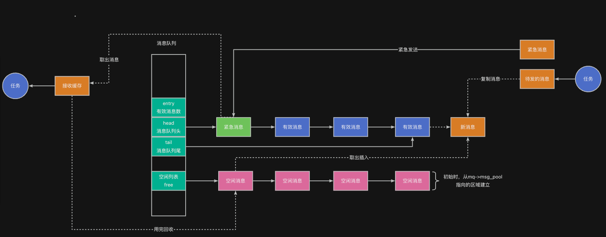

> 为了更好地使用RTOS，我们需要深入理解RTOS工作原理，最好的方法是动手写一个RTOS。
>
> 如果你希望写一个类似RT-Thread/FreeRTOS的系统，欢迎关注这门课程：[【RTOS内核开发】从0手写嵌入式操作系统](https://zw8ls.xetlk.com/s/H2F1Y)
>

邮箱仅支持传递固定大小的消息内容（在32位系统上是4字节），当需要传递较大的消息时，只能通过指针的方式去传递，在有些情况下，会加重程序中管理内存的负担。

因此，有时使用消息队列会更加的方便。

---

## 消息队列机制的用途
消息队列也可用于任务之间、任务与中断之间的通信；相比邮箱，其特点如下：

| 特性 | 邮箱（Mailbox） | 消息队列（Message Queue） |
| --- | --- | --- |
| 传递内容 | 4字节（值或指针） | 不定长的数据块 |
| 缓冲方式 | 循环队列（值/指针） | 循环队列（结构体数据） |
| 内存管理风险 | 有（需手动管理指针） | 安全（消息会拷贝进队列中） |


## 工作原理
RT-Thread 的消息队列由struct rt_messagequeue实现，内部维护了一个消息循环缓冲区，自动管理内存拷贝和顺序读取。其整体工作结构如下图所示：



对于上述结构图，相关说明如下：

+ 在消息队列内部，有相应的消息缓冲区可以存储消息，任务写入的消息会被拷贝到该缓冲区。因此，任务在完成消息发送之后，不需要继续持有待发消息的内存块。任务在读取消息时，消息会从缓冲中拷贝到任务自己的接收缓存。
+ 消息队例会自动管理这些消息缓冲区。在创建消息队列时，可以指定该缓冲区最大能缓存多少个消息，每个消息的最大允许的数量字节量。
+ 消息的写入和读取，可支持先进先出（FIFO），也支持后进先出（LIFO，用于发送紧急消息）
+ 当消息队列已满时，发送方可以阻塞等待直至消息写入；当消息队列为空时，接收方可以阻塞等待，直至收到消息。

| 特性 | 描述 |
| --- | --- |
| 定长数据块 | 每个消息大小固定，初始化时指定 |
| 先进先出 | 接收者按照发送顺序获取消息 |
| 同步机制 | 满时发送者阻塞，空时接收者阻塞 |


---

## 应用示例
下面对邮箱课时中的案例进行修改，使用消息队列完成同样的功能。

### 示例一：传递消息编号
```c
#include "base.h"
#include <rtthread.h>

static struct rt_messagequeue mq;

static rt_ubase_t mq_buffer[8];

void sender_entry (void * param) {
    rt_ubase_t msg = 0;
    
    while (1) {
        rt_mq_send_wait(&mq, &msg, sizeof(msg), RT_WAITING_FOREVER);
        msg++;
    }
}

void recv_entry (void * param) {
    while (1) {
        // recv
        rt_ubase_t msg;
        
        rt_mq_recv(&mq, &msg, sizeof(msg), RT_WAITING_FOREVER);
        rt_kprintf("recv: %d\n", msg);
        rt_thread_mdelay(1000);
    }
}

int main(void) {
    hardware_init();
    
    rt_mq_init(&mq, "mq", mq_buffer, sizeof(rt_ubase_t), 8, RT_IPC_FLAG_FIFO);
    
    rt_thread_t t1 = rt_thread_create("t1", sender_entry, RT_NULL, 4096, 10, 10);
    rt_thread_startup(t1);
    rt_thread_t t2 = rt_thread_create("t2", recv_entry, RT_NULL, 4096, 10, 10);
    rt_thread_startup(t2);
    
    return 0;
}

```

### 示例二：传递结构化温湿度数据
```c
#include "base.h"
#include <rtthread.h>

static struct rt_messagequeue mq;

struct sensor_data {
    int temp;
    int hum;
};

static struct sensor_data mq_buffer[8];

static void sensor_read (struct sensor_data * data) {
    data->temp = 20 + rt_tick_get();
    data->hum = 50 + rt_tick_get();
}

void sender_entry (void * param) {    
    while (1) {
        //struct sensor_data * data = (struct sensor_data *)malloc(sizeof(struct sensor_data));
        struct sensor_data data;
        sensor_read(&data);
        //rt_mb_send_wait(&mbox, (rt_ubase_t)data, RT_WAITING_FOREVER);
        rt_mq_send_wait(&mq, &data, sizeof(struct sensor_data), RT_WAITING_FOREVER);
        rt_thread_mdelay(1000);
    }
}

void recv_entry (void * param) {
    while (1) {
        // recv
        struct sensor_data data;
    
        rt_mq_recv(&mq, &data, sizeof(struct sensor_data), RT_WAITING_FOREVER);
        //rt_mb_recv(&mbox, (rt_ubase_t* )&data, RT_WAITING_FOREVER);
        
        rt_kprintf("temp: %d, hum: %d\n", data.temp, data.hum);
        //free(data);
    }
}

int main(void) {
    hardware_init();
    
    rt_mq_init(&mq, "mq", mq_buffer, sizeof(struct sensor_data), sizeof(mq_buffer), RT_IPC_FLAG_FIFO);
    
    rt_thread_t t1 = rt_thread_create("t1", sender_entry, RT_NULL, 4096, 10, 10);
    rt_thread_startup(t1);
    rt_thread_t t2 = rt_thread_create("t2", recv_entry, RT_NULL, 4096, 10, 10);
    rt_thread_startup(t2);
    
    return 0;
}
```

