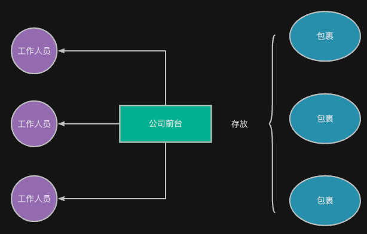
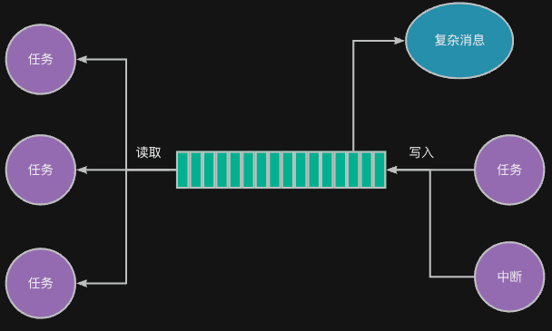

任务在执行过程中，除了要与别的任务行为同步之外，有时还需要向其它任务发送消息，或者接收其它任务发来的消息并进行处理。

---

## 生活示例
想象一下，公司前台有个快递柜。快递员把包裹放进收件柜（邮箱）之后通知你。你可以从快递柜中取出任何人给你发来的包裹。



这个“一个人发送消息，另一个人接收处理”的机制，就是邮箱（mailbox）的核心思想：**任务之间通过邮箱传递消息，邮箱中可以暂存一定数量的消息，接收者从中获取信息**。

## 邮箱机制的用途
在 RTOS 中，邮箱常用于以下场景：

+ 传递较小的数据结构（如指针、消息编号）
+ 任务间需要排队传递信息
+ ISR（中断服务函数）与任务之间的数据传递

相较于事件机制的“发生了什么”，邮箱机制更强调“**发生了什么 + 附带的数据**”。因此，可以看出，邮箱相比信号量、事件等机制，可以提供更多的信息。

## 工作原理
RT-Thread 的邮箱由 struct rt_mailbox对象实现，其内部维护了一个**循环队列**，用来保存发送方写入的消息。其关键特性包括：

| 特性 | 描述 |
| --- | --- |
| 消息缓冲 | 内部有一块缓冲区，可以存储多个消息（指针或数值） |
| 先进先出 | 接收方按照发送顺序获取消息 |
| 同步机制 | 若缓冲区满，发送者阻塞；若为空，接收者阻塞 |


具体工作原理如下图所示。注意，邮箱本身拥有存储消息的空间，每个消息最大是4字节。当要传递较为复杂的消息时，可以将消息的内存存储在某块内存中，然后将存储的地址作为消息传给对方。



其主要包含以下核心操作：

| 操作 | 说明 |
| --- | --- |
| **<font style="color:rgb(37, 53, 85);background-color:rgb(226, 232, 242);">send（发送）</font>** | 非阻塞发送一个消息 |
| recv（接收） | 接收一个消息，可指定超时时间 |
| **<font style="color:rgb(37, 53, 85);background-color:rgb(226, 232, 242);">send_wait（阻塞发送）</font>** | 阻塞发送一个消息，邮箱满时，阻塞等待空闲的消息存储空间 |


## 与其他同步机制的对比
| 特性 | 信号量 | 事件 | 邮箱 |
| --- | --- | --- | --- |
| 数据传递 | 否 | 否 | 是（传递数值/指针） |
| 多任务接收 | 通常一个 | 可多个 | 通常一个 |
| 缓冲 | 否 | 否 | 是（循环队列） |
| 适用场景 | 简单同步 | 等待多个事件 | 任务间消息传递 |


## 应用示例代码
### 简单的消息传送
下面是一个通过邮箱传递消息编号的简单示例：

```c
#include "base.h"
#include <rtthread.h>

static struct rt_mailbox mbox;

static rt_ubase_t mbox_buffer[8];

void sender_entry (void * param) {
    rt_ubase_t msg = 0;
    
    while (1) {
        rt_mb_send_wait(&mbox, msg, RT_WAITING_FOREVER);
        msg++;
    }
}

void recv_entry (void * param) {
    while (1) {
        // recv
        rt_ubase_t msg;
        
        rt_mb_recv(&mbox, &msg, RT_WAITING_FOREVER);
        rt_kprintf("recv: %d\n", msg);
        rt_thread_mdelay(1000);
    }
}

int main(void) {
    hardware_init();
    
    rt_mb_init(&mbox, "mb", mbox_buffer, 8, RT_IPC_FLAG_FIFO);
    
    rt_thread_t t1 = rt_thread_create("t1", sender_entry, RT_NULL, 4096, 10, 10);
    rt_thread_startup(t1);
    rt_thread_t t2 = rt_thread_create("t2", recv_entry, RT_NULL, 4096, 10, 10);
    rt_thread_startup(t2);
    
    return 0;
}

```

### 通过指针传递更为复杂的消息
下面的例子展示了如何通过指针传递更为复杂的数据-温湿度值。这些传存储在rt_malloc()分配的内存中，之后通过rt_mb_send()发给消息接收方processing_thread；最后，由该任务处理消息并调用rt_free()进行释放。

```c
#include "base.h"
#include <rtthread.h>

static struct rt_mailbox mbox;

static rt_ubase_t mbox_buffer[8];

struct sensor_data {
    int temp;
    int hum;
};

static void sensor_read (struct sensor_data * data) {
    data->temp = 20 + rt_tick_get();
    data->hum = 50 + rt_tick_get();
}

void sender_entry (void * param) {    
    while (1) {
        struct sensor_data * data = (struct sensor_data *)malloc(sizeof(struct sensor_data));
        sensor_read(data);
        rt_mb_send_wait(&mbox, (rt_ubase_t)data, RT_WAITING_FOREVER);
        
        rt_thread_mdelay(1000);
    }
}

void recv_entry (void * param) {
    while (1) {
        // recv
        struct sensor_data * data;
   
        rt_mb_recv(&mbox, (rt_ubase_t* )&data, RT_WAITING_FOREVER);
        
        rt_kprintf("temp: %d, hum: %d\n", data->temp, data->hum);
        free(data);
    }
}

int main(void) {
    hardware_init();
    
    rt_mb_init(&mbox, "mb", mbox_buffer, 8, RT_IPC_FLAG_FIFO);
    
    rt_thread_t t1 = rt_thread_create("t1", sender_entry, RT_NULL, 4096, 10, 10);
    rt_thread_startup(t1);
    rt_thread_t t2 = rt_thread_create("t2", recv_entry, RT_NULL, 4096, 10, 10);
    rt_thread_startup(t2);
    
    return 0;
}
```


