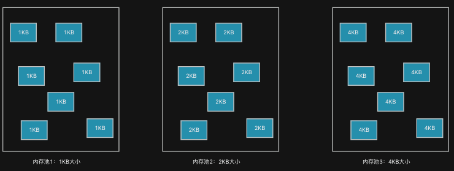
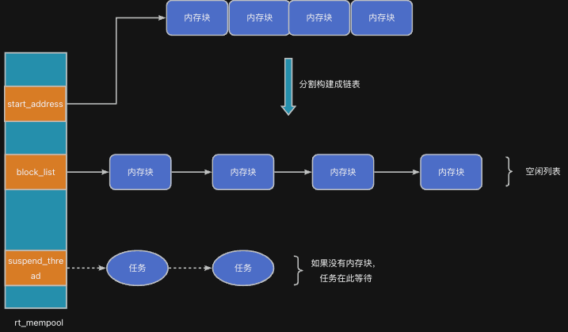

任务在运行的过程中，有时需要动态的申请分配内存。大多数情况下，任务申请分配的内存块大小是固定的；于是，为了提升分配效率和速度，RT-Thread提供了内存池功能。

## 生活示例
想象你是一家工厂负责打包商品的工作人员，且客户购买的商品数量是可变的。如果根据客户的商品量找出刚刚能装下的包装盒；那么，此事将是一件费时费力的工作。

> 要么仓库里要提前准备好大大小小各种规格的包装盒；要么仓库里仅存放制作包装盒的材料，在需要时根据客户的需求制造大小刚好合适的盒子。
>


显然，无论是哪种方法，都不是高效的方法。如果换一种方式，仓库仅存储若干尺寸大小的盒子。当需要包装商品时，选一个能装下的盒子（哪怕有多余的空间）即可。这样一来，找盒子这一过程就非常快了。

## 内存池用途
类似地，在嵌入式系统中，任务的运行需要用到动态分配的内存块。不同场景下，任务所需的内存块大小可能不同。但是，在一个特定的产品中，整个程序中需要动态分配的内存块大小种类往往是极其有限的。

针对这种情况下，RT-Thread提供了内存池功能。简单来说，内存池机制就像这样的仓库：<font style="color:#2F4BDA;">它一次性分配一大块内存，然后把它拆成多个固定大小的小块，任务或中断服务函数可以快速地从中申请或释放这些内存块</font>。



内存池适用于以下典型场景：

+ 需要频繁申请/释放固定大小内存的情况
+ 多任务/中断共享内存资源
+ 内存使用需要快速响应（避免使用malloc()或free()）
+ 嵌入式系统中需要确定性的内存分配方式

相较于malloc()或free()等堆分配方式，内存池具有**更快、更稳定、更可控**的优点。具体原因在下面介绍。

## 工作原理
RT-Thread的内存池由struct rt_mempool对象实现，其内部管理一个**固定大小的内存块链表**，通过分配与释放内存块来服务不同任务。



根据上图所示，当任务需要分配或释放内存时，只需要对block_list的头部进行操作（取出或插入头结点），分配效率极高。

| 特性 | 描述 |
| --- | --- |
| 定长块 | 所有内存块大小一致，由初始化时指定 |
| 预分配 | 创建内存池时就分配全部内存，不会动态增长或缩减 |
| 快速响应 | 分配和释放效率极高（无需遍历内存或碎片整理） |
| 支持阻塞等待 | 申请内存块时可设定超时等待 |


## 应用示例代码：分配和回收固定大小的消息结构体
```c
#include "base.h"
#include <rtthread.h>

static struct rt_mailbox mbox;

static rt_ubase_t mbox_buffer[8];

struct sensor_data {
    uint8_t temp;
    uint8_t hum;
};
static uint8_t mem_pool[8*(RT_ALIGN(sizeof(struct sensor_data), RT_ALIGN_SIZE) + sizeof(uint8_t *))];
static struct rt_mempool mpool;

static void sensor_read (struct sensor_data * data) {
    data->temp = 20 + rt_tick_get();
    data->hum = 50 + rt_tick_get();
}

void sender_entry (void * param) {    
    while (1) {
        struct sensor_data * data = (struct sensor_data *)rt_mp_alloc(&mpool, RT_WAITING_FOREVER);
        sensor_read(data);
        rt_mb_send_wait(&mbox, (rt_ubase_t)data, RT_WAITING_FOREVER);
        
        rt_thread_mdelay(1000);
    }
}

void recv_entry (void * param) {
    while (1) {
        // recv
        struct sensor_data * data;
   
        rt_mb_recv(&mbox, (rt_ubase_t* )&data, RT_WAITING_FOREVER);
        
        rt_kprintf("temp: %d, hum: %d\n", data->temp, data->hum);
        rt_mp_free(data);
    }
}

int main(void) {
    hardware_init();
    
    rt_mb_init(&mbox, "mb", mbox_buffer, 8, RT_IPC_FLAG_FIFO);
    rt_mp_init(&mpool, "mp", mem_pool, sizeof(mem_pool), sizeof(struct sensor_data));
    
    rt_thread_t t1 = rt_thread_create("t1", sender_entry, RT_NULL, 4096, 10, 10);
    rt_thread_startup(t1);
    rt_thread_t t2 = rt_thread_create("t2", recv_entry, RT_NULL, 4096, 10, 10);
    rt_thread_startup(t2);
    
    return 0;
}
```


